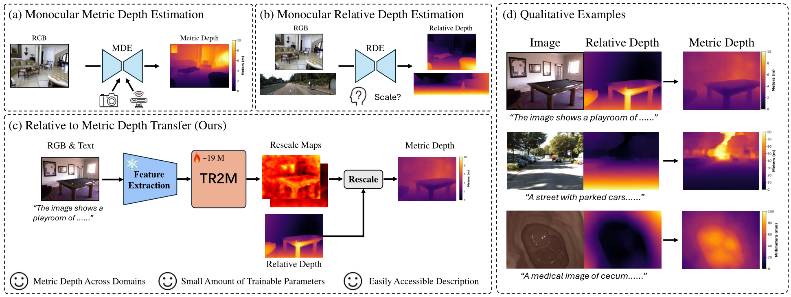
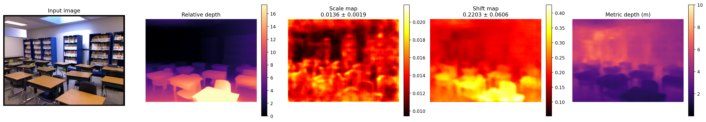

<div align="center">
<h1 style="border-bottom: none; margin-bottom: 0px ">TR2M: Transferring Monocular Relative Depth to Metric Depth with Language Descriptions and Dual-Level Scale-Oriented Contrast</h1>

[**Beilei Cui**](https://beileicui.github.io/)<sup>&ast;</sup> · [**Yiming Huang**](https://lastbasket.github.io/)<sup>&ast;</sup> · [**Long Bai**](https://longbai-cuhk.github.io/) · [**Hongliang Ren**](http://www.labren.org/mm/principal-investigator/)<sup>&dagger;</sup>

[](https://arxiv.org/abs/2506.13387)

&ast;Equal Contribution&emsp;&dagger;Corresponding Author

</div>

<p align="center">
  
</p>

## Overview

TR2M is a generalisable framework that converts a monocular **relative** depth map into a **metric** one by predicting per-pixel rescale maps from an RGB image and a text description. Given a frozen relative-depth backbone (e.g. DepthAnything) producing a relative depth `D_r`, TR2M outputs a per-pixel **scale map** `A` and **shift map** `B`, and recovers metric depth as:

```
D̂_m = 1 / (A ⊙ D_r + B)
```

Image and text features are extracted by frozen DINOv2 and CLIP encoders, fused by a self-attention plus cross-modality attention transformer, and decoded into the fine scale/shift maps by two lightweight DPT-style heads. Compared to language-conditioned methods that regress a single global scale and shift (e.g. RSA), pixel-wise rescaling is robust to locally-wrong regions of the relative-depth prediction; compared to dedicated metric depth estimators, TR2M only trains a small head (~19M parameters) on top of frozen backbones, which keeps cross-domain generalisation.

## Highlights

- **Pixel-wise rescale maps.** Two lightweight decoders predict full-resolution `A` and `B` instead of a single scalar pair, fixing regions where the relative-depth backbone is locally wrong.
- **Threshold-aligned pseudo metric depth.** A closed-form least-squares fit between `D_r` and ground truth gives a dense pseudo label; only frames whose δ₁ accuracy passes a threshold are used as extra supervision, complementing sparse GT (especially on outdoor data).
- **Dual-Level Scale-Oriented Contrast.** An image-level coarse contrast aligns embeddings of scenes with similar overall scale; a pixel-level fine contrast (with an EMA momentum branch) groups pixel features by their depth-distribution class. Together they sharpen the model's scale perception across domains.
- **Compact and generalisable.** Only 19M trainable parameters and 102K training images (NYUv2 + KITTI + VOID + C3VD). The released checkpoint runs on the four training sets in-domain and on SUN RGB-D, iBims-1, HyperSim, DIODE Outdoor and SimCol zero-shot.

## News

- **2026.05.25** — Evaluation code and pretrained weights are released.
- **2026.02.20** — Paper accepted to **CVPR 2026**.

## Installation

```bash
git clone https://github.com/BeileiCui/TR2M.git
cd TR2M
conda create -n tr2m python=3.10 -y
conda activate tr2m
pip install -r requirements_eval.txt
```

The code was tested with PyTorch 2.5.0 + CUDA 11.8 on Python 3.10. `torch.hub` is used to load DINOv2 from `facebookresearch/dinov2`, so make sure the host has internet access on first run (or pre-cache the hub directory).

## Pretrained weights

The trained TR2M ScaleMap weight is shipped under [weights/](weights/):

| Model | Backbone | Image enc. | Text enc. | Path |
| --- | --- | --- | --- | --- |
| TR2M (paper) | DepthAnything ViT-S | DINOv2 ViT-L | CLIP ViT-L/14 | `weights/da_s_vitl_vitl.pth` |

The frozen relative-depth backbone weights need to be downloaded separately and placed under `depth_anything/`:

| File | Source |
| --- | --- |
| `depth_anything/depth_anything_vits14.pth` | [DepthAnything releases](https://github.com/LiheYoung/Depth-Anything) |
| `depth_anything/depth_anything_vitb14.pth` | (only required for `da_b`) |
| `depth_anything/depth_anything_vitl14.pth` | (only required for `da_l`) |

DINOv2 image-encoder weights are fetched automatically by `torch.hub` on first run.

## Quick demo

[run.py](run.py) runs the full TR2M pipeline on a single RGB image plus a text description, and saves a 1×5 visualisation (input image, relative depth, scale map, shift map, metric depth):

```bash
python run.py \
    --image figures/sample_indoor.jpg \
    --text "The image shows a classroom with rows of desks and chairs, and blue bookshelves." \
    --output figures/sample_indoor_output.png
```

By default it loads `weights/da_s_vitl_vitl.pth` and runs at the NYU eval resolution (434×560). Common overrides:

| Flag | Default | Description |
| --- | --- | --- |
| `--weight` | `weights/da_s_vitl_vitl.pth` | TR2M ScaleMap weight |
| `--output` | `output.png` | Output visualisation path |
| `--vis_low_percentile` / `--vis_high_percentile` | `1` / `95` | Percentile range used to set the colour bars on the relative- and metric-depth panels |
| `--input_height` / `--input_width` | `434` / `560` | Resize fed to the model; both must be multiples of 14 |
| `--device` | `cuda` | Falls back to CPU automatically if CUDA is unavailable |

The console also prints the predicted metric depth's min / mean / max in metres, which is a quick sanity check on whether the text description matched the scene scale.

You should get a visualisation like this:

<p align="center">
  
</p>

## Data preparation

Download the datasets you want to evaluate on and point the corresponding `--*_root` argument (or the `*_root = ...` line in the config file) at the local copy. Split files in [data_splits/](data_splits/) and per-image text descriptions in [text/text_all/](text/text_all/) are bundled with the repo and read with paths relative to the project root, so just run the eval scripts from this directory.

### Example 1 — NYU Depth V2 (in-domain)

Expected layout (matches the standard `nyu_depth_v2` release):

```
<NYU_ROOT>/
  sync/                          # training frames (used for filename listing)
  official_splits/
    test/                        # evaluation RGB + depth
```

Then set `nyu_root = <NYU_ROOT>` in [configs/arguments_eval_indomain_da_tg.txt](configs/arguments_eval_indomain_da_tg.txt) (or pass `--nyu_root <NYU_ROOT>` on the command line).

### Example 2 — iBims-1 (zero-shot)

Download iBims-1 and unpack so that the structure looks like:

```
<IBIMS_ROOT>/
  imagelist.txt
  rgb/        *.png
  depth/      *.png
  mask_invalid/  *.png
  mask_transp/   *.png
```

Then set `ibims_root = <IBIMS_ROOT>` in [configs/arguments_eval_zero_da_tg.txt](configs/arguments_eval_zero_da_tg.txt).

### All supported datasets

| Split type | Dataset | CLI flag | Source |
| --- | --- | --- | --- |
| In-domain | NYU Depth V2 | `--nyu_root` | [link](https://cs.nyu.edu/~silberman/datasets/nyu_depth_v2.html) |
| In-domain | KITTI (raw + Eigen GT) | `--kitti_root`, `--kitti_gt_root` | [raw](https://www.cvlibs.net/datasets/kitti/raw_data.php) / [GT](https://www.cvlibs.net/datasets/kitti/eval_depth.php?benchmark=depth_prediction) |
| In-domain | VOID | `--void_root` | [link](https://github.com/alexklwong/void-dataset) |
| In-domain | C3VD | `--c3vd_root` | [link](https://durrlab.github.io/C3VD/) |
| Zero-shot | SUN RGB-D | `--sunrgbd_root` | [link](https://rgbd.cs.princeton.edu/) |
| Zero-shot | iBims-1 | `--ibims_root` | [link](https://www.asg.ed.tum.de/lmf/ibims1/) |
| Zero-shot | DIODE (outdoor) | `--diode_root` | [link](https://diode-dataset.org/) |
| Zero-shot | HyperSim | `--hypersim_root` | [link](https://github.com/apple/ml-hypersim) |
| Zero-shot | SimCol | `--simcol_root` | [link](https://www.synapse.org/Synapse:syn28548633/wiki/) |

## Evaluation

### In-domain (NYU / KITTI / VOID / C3VD)

Edit dataset roots in [configs/arguments_eval_indomain_da_tg.txt](configs/arguments_eval_indomain_da_tg.txt), then:

```bash
python eval_indomain.py --config configs/arguments_eval_indomain_da_tg.txt
```

You can also override roots from the command line:

```bash
python eval_indomain.py --config configs/arguments_eval_indomain_da_tg.txt \
    --nyu_root /data/nyu_depth_v2 \
    --kitti_root /data/kitti_raw \
    --kitti_gt_root /data/kitti_gt \
    --void_root /data/void_release \
    --c3vd_root /data/C3VD_undistort
```

### Zero-shot (SUN RGB-D / iBims-1 / DIODE / HyperSim / SimCol)

Edit dataset roots in [configs/arguments_eval_zero_da_tg.txt](configs/arguments_eval_zero_da_tg.txt), then:

```bash
python eval_zero.py --config configs/arguments_eval_zero_da_tg.txt
```

### Reading the output

For each dataset, the script prints all nine metrics in the order:

```
silog, abs_rel, log10, rms, sq_rel, log_rms, d1, d2, d3
```

`eval_indomain.py` additionally prints a "results-for-sheets" line per dataset with the subset of columns commonly reported in tables (e.g. for NYUD2: `d1, d2, d3, abs_rel, log10, rms`).

To dump per-sample visualisations (RGB / GT / relative depth / metric depth / scale / shift PNGs) into `<load_ckpt_path>_vis/<dataset>/`, add `--visualize_results` to either eval command.

## Repository layout (relevant to evaluation)

```
eval_indomain.py          in-domain evaluation (NYU/KITTI/VOID/C3VD)
eval_zero.py              zero-shot evaluation (SUNRGB-D/iBims/DIODE/HyperSim/SimCol)
run.py                    single-image demo (one RGB + one text description)
options.py                CLI / config parsing (configargparse)
scalemap_depth.py        ScaleMap (cross-attention scale+shift head used at eval)
attention.py / block.py / pos_embed.py
                          RoPE-equipped attention building blocks
loss.py                   compute_scale_and_shift + losses
utils.py                  metric helpers (compute_errors), text loader, visualisation
depth_anything/           DepthAnything backbone (place .pth weights here)
CLIP/                     vendored CLIP text encoder
torchhub/                 vendored DINOv2 (loaded via torch.hub)
dataloaders/
  dataset_nyukiti.py      NYU + KITTI + VOID + C3VD (mixed loader)
  dataset_c3vd.py         C3VD
  datasets_void.py        VOID
  dataset_test.py         SUN RGB-D / iBims / DIODE / HyperSim
  dataset_simcol.py       SimCol
configs/                  eval / train arg files
data_splits/              file lists for each dataset
text/text_all/            per-image text descriptions consumed by CLIP
```

Training code will be released after some additional cleanup.

## Citation

If you find this work useful, please cite:

```bibtex
@inproceedings{cui2026tr2m,
  title     = {TR2M: Transferring Monocular Relative Depth to Metric Depth with
               Language Descriptions and Dual-Level Scale-Oriented Contrast},
  author    = {Cui, Beilei and Huang, Yiming and Bai, Long and Ren, Hongliang},
  booktitle = {Proceedings of the IEEE/CVF Conference on Computer Vision and
               Pattern Recognition (CVPR)},
  year      = {2026}
}
```

## Acknowledgements

This codebase builds on the open-source releases of
[DepthAnything](https://github.com/LiheYoung/Depth-Anything),
[DINOv2](https://github.com/facebookresearch/dinov2),
[CLIP](https://github.com/openai/CLIP),
[VOID](https://github.com/alexklwong/void-dataset),
[MiDaS](https://github.com/isl-org/MiDaS) and
[RSA](https://github.com/Adonis-galaxy/RSA). We thank the authors for sharing their code and models.
